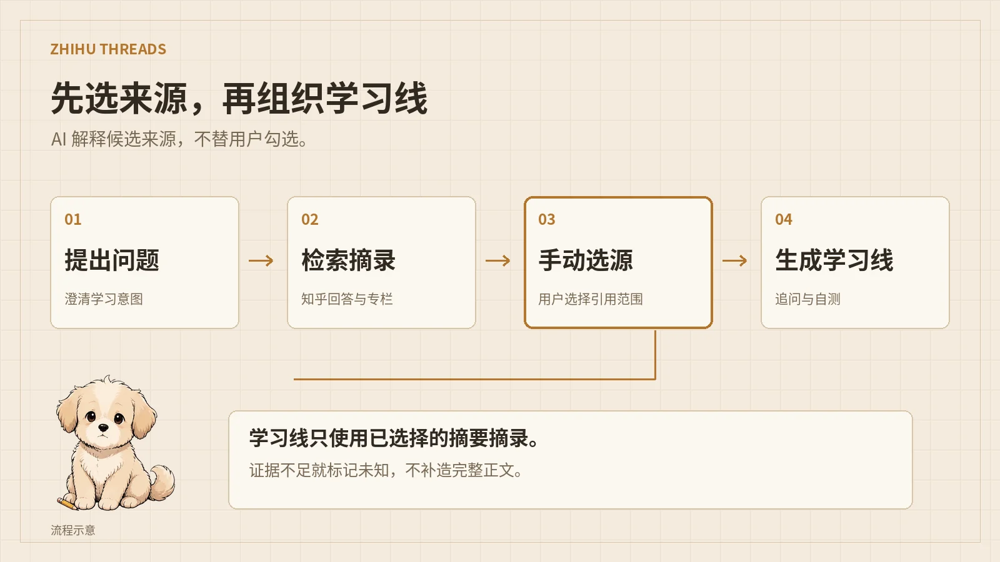

<p align="center">
  
</p>

# Zhihu Threads

[English](./README.en.md)

封面与流程图沿用 Lora Field Notes 的原创角色和纸张视觉。它们是功能示意，不是产品截图。

输入一个模糊问题，AI 从真实知乎回答和专栏文章中串联证据，组织成可追溯、可追问、可自测的学习线。它不替代知乎——它把知乎的知识变成更易学的结构。

## 工作方式



```
问题 → 澄清 → 搜索 → 选证据 → AI 串联 → 学习线 → 追问 → 收藏导出
```

AI 澄清学习意图后，从知乎搜索返回回答和专栏文章的摘要级摘录。你手动勾选要引用的来源（AI 只解释候选，不替你选），系统基于选中摘录生成**记忆廊桥**：按时间排列的学习节点、来源角色、开放追问和自测题。线程内 Study Agent 可以继续追问，但只基于当前线程摘录回答——证据不够时说「证据不足」，不编造。

## 快速开始

```bash
pnpm install && pnpm dev
```

打开 dev server 输出的地址（不假设固定端口）。

```bash
pnpm check      # 类型检查
pnpm test       # 345 tests
pnpm build      # 生产构建
```

## 技术栈

| 层       | 技术                                                                                          |
| :------- | :-------------------------------------------------------------------------------------------- |
| 框架     | [TanStack Start](https://tanstack.com/start) · [TanStack Router](https://tanstack.com/router) |
| 样式     | [Tailwind CSS 4](https://tailwindcss.com/)                                                    |
| 效果系统 | [Effect TS](https://effect.website/)                                                          |
| 持久化   | SQLite (better-sqlite3)                                                                       |
| 测试     | Vite+ · 345 tests                                                                             |

## 项目结构

```
src/
  routes/                    # TanStack Router 文件式路由
    index.tsx                # 搜索入口 + 候选选择
    thread/$threadId.tsx     # 记忆廊桥 + Study Agent
    evals.tsx                # 评测看板
  server/                    # server functions
    clarify-question.ts      # AI 澄清
    search-answer-candidates.ts  # 知乎搜索 + 摘录持久化
    rank-answer-candidates.ts    # AI 候选解释
    generate-thread-artifact.ts  # 线程合成
    ask-thread-agent.ts      # 线程内追问
  lib/                       # 纯域层
    thread-artifact.ts       # 线程域记录
    thread-synthesis.ts      # 证据校验合成
    thread-study-agent.ts    # grounded agent
  evals/                     # 264 条冻结黄金集
```

## 评测

264 条冻结黄金题（SHA-256 锁定，不可修改）：RAG 96、工具调用 48、多轮 48、Bug 回归 36、对抗安全 36。每次运行保存完整 JSON trace（工具输入/输出/耗时/错误），支持版本对比。

本地 `/evals` 页面可视化所有 run：质量概览、失败分布、trace inspector。

```bash
EVAL_DATASET=golden-v2.jsonl EVAL_LIMIT=66 EVAL_STRIDE=4 EVAL_CONCURRENCY=8 pnpm eval
```

## 数据边界

只使用官方 API 返回的摘要级 `ContentText`，不伪装成完整正文。来源可以是知乎回答或专栏文章（均标注）。证据不足时使用诚实的 `unknown` / `evidence_gap` 状态，不编造内容。AI 内部细节不对用户暴露。

## 许可证

MIT
